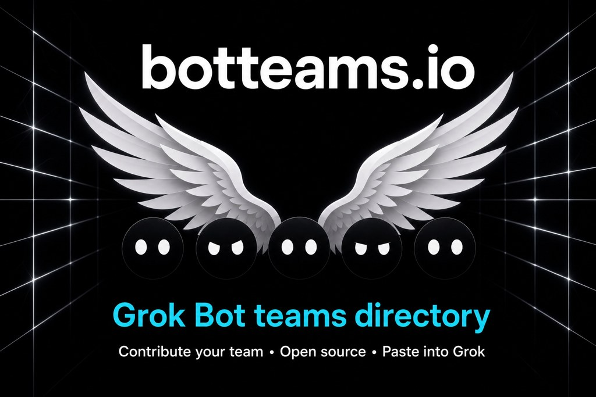

<p align="center">
  <a href="https://botteams.ai">
    
  </a>
</p>

# Grok Bot Teams

[](https://github.com/ellelion/botteams/actions/workflows/ci.yml)
[](./LICENSE)

Install a Grok Bot team, not a bot.

A public directory of company teams for Grok Bot. Pick a team, copy one installer
prompt, paste it into Grok Bot. It creates the named Bots, the group chat, and
proposes the routines for you to confirm.

[botteams.ai](https://botteams.ai) · no accounts · MIT · not affiliated with xAI

## The directory is a repo

A team is one markdown file in [`teams/`](./teams). Front matter names the Bots,
the group chat, the routines, and the connectors. The installer prompt is
generated from it, so the file is the product and GitHub is the CMS.

Every team and bot must pass the public
[JSON Schema](https://botteams.ai/schema/team.schema.json) plus the repository's
semantic checks. `kind: team` or `kind: bot` defines the shape.
`status: installable` or `status: example` defines whether it is ready to run.

To add one, copy [`docs/examples/sample-team.md`](./docs/examples/sample-team.md)
or [`docs/examples/sample-bot.md`](./docs/examples/sample-bot.md) and read
[CONTRIBUTING.md](./CONTRIBUTING.md). The bar is that you ran it end to end.

## Pages

| Route | What |
|---|---|
| `/` | Team index. Search, category, connector filter, sort. |
| `/teams/<slug>` | A team: Bots, group chat, routines, installer prompt, and Customize. |
| `/bots/<slug>` | A bot: one Bot, routines, installer prompt, and Customize. No group chat, no Verified. |
| `/grok-bot` | What is Grok Bot? Setup, teams, skills, routines, and limits. |
| `/guides` | How-to, comparison, access, and job pages. One query per URL. |
| `/docs` | The team spec. Our recipe format, mapped onto official Grok Bot nouns. |
| `/connectors` | Every connector Grok Bot reaches, and which teams use each. |
| `/api` | Public API contract, readable without JavaScript. |
| `/sponsor` | Sponsor listing and rules. |

## Where the teams come from

There are two shapes and the site never adds them up.

A **team** is two to six Bots in one group chat. It lives in `teams/`, at
`/teams/<slug>`, and it can be Verified.

A **bot** is one Bot doing one job, with no group chat. It lives in
`bots/`, at `/bots/<slug>`, and it is never Verified, because Verified is
a claim about a group chat and a bot makes none.

56 of the bots are written up from jobs xAI publishes in its
[Grok Bot use-case gallery](https://x.ai/bot/use-cases). Those carry
`from_xai: true` and show a **From xAI** chip linking to the source. That
is sourcing, not endorsement: the title and the category are xAI's,
everything else is ours, and xAI does not review or certify anything here.

The index opens on teams. Bots is one click, All shows both and labels
every row.

## Customize

Every team page can be edited in place: turn Bots off, rename them, set the
group chat, set how far each connector goes, and add standing instructions.
The installer prompt rewrites as you go and one Copy pill takes it.

The edits live in the URL hash, so a customized team is shareable and
nothing is stored on the site. Download gives you the same team back as a
team file you could open a pull request with.

A connector mode is **wording in the prompt, not a permission**. Grok Bot
connectors are account-wide: every Bot on the account can reach every
connected tool, and separate Bots are not a security boundary. The only
real switch is Grok Bot Settings, then Plugins, which is account-wide too.
The UI says so rather than drawing a lock the product does not have.

Per team, in the team file: `connector_modes` and `suggest`. See
[CONTRIBUTING.md](./CONTRIBUTING.md).

## API

No key, no auth, CORS open.

```bash
curl "https://botteams.ai/api/teams?integration=Stripe&limit=5"
curl "https://botteams.ai/api/bots?category=Sales"
curl "https://botteams.ai/api/teams?limit=100"
curl "https://botteams.ai/api/teams?cursor=start&limit=100"
```

Full contract at [`/api`](https://botteams.ai/api). There is no per-team
endpoint by design; filter the collection instead.

## Develop

```bash
npm install
npm run dev        # localhost:3000
npm run validate   # team schema and category checks
npm run lint       # code quality
npm run build      # types plus production build
npm test           # all local merge checks
```

Node 22.12.0 (see `.nvmrc`).

## Language

A row is a **team**. The unit is a **Bot**, capital B. Group chats hold two to six Bots. No em-dashes.

`kind: team` or `kind: bot` is the shape. `status: installable` is a recipe
you can run. `status: example` is a format demo. No other status values are valid.

Canonical domain: botteams.ai.

## Open source

Contributions are welcome through pull requests. Read
[CONTRIBUTING.md](./CONTRIBUTING.md), the [Code of Conduct](./CODE_OF_CONDUCT.md),
and [GOVERNANCE.md](./GOVERNANCE.md) before you start. Report security issues
privately as described in [SECURITY.md](./SECURITY.md).

`main` is protected. Contributors must use a pull request, pass every required
check, and receive approval from `@icidab`. The `@icidab` maintainer account
may bypass the pull-request and status-check rules or push directly to `main`.
CI still runs after a direct push. Branch deletion, force pushes, and nonlinear
history cannot be bypassed.

## Stack

Next.js 16.3.2, React 19.2.4, TypeScript, Tailwind 4, gray-matter.
